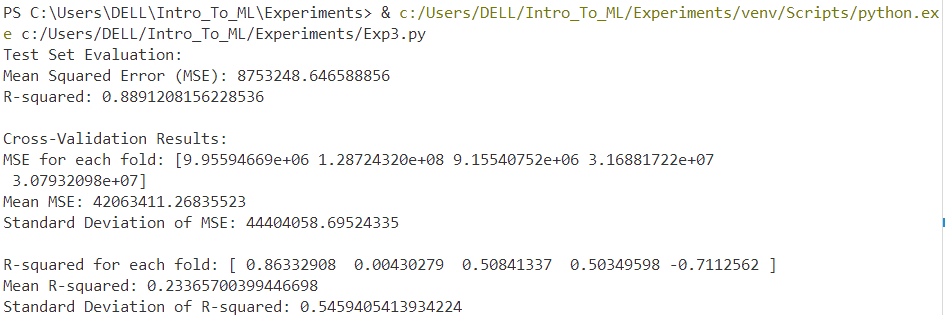

# Implementation-of-Multiple-Linear-Regression-Model-with-Cross-Validation-for-Predicting-Car-Prices

## AIM:
To write a program to predict the price of cars using a multiple linear regression model and evaluate the model performance using cross-validation.

## Equipments Required:
1. Hardware – PCs
2. Anaconda – Python 3.7 Installation / Jupyter notebook

## Algorithm
1. Import Libraries
- Import pandas, numpy, and scikit-learn modules for data processing and modeling.
2. Load the dataset.
- Load the dataset from encoded_car_data.csv.
3. Select Features and Target

- Separate features (X) and target (y) for the model.
4. Split Dataset

- Divide data into training and testing sets (80-20 ratio).
5. Train Model

- Fit a Multiple Linear Regression model using the training data.
6. Evaluate Test Set

- Calculate MSE and R-squared for test predictions.
7. Perform Cross-Validation

- Conduct 5-fold cross-validation to compute MSE and R-squared values.
8. Output Results

- Print evaluation metrics and cross-validation results.
## Program:
```
/*
Program to implement the multiple linear regression model for predicting car prices with cross-validation.
Developed by: Vishwaraj G.
RegisterNumber: 212223220125
*/
import pandas as pd
from sklearn.model_selection import train_test_split, cross_val_score
from sklearn.linear_model import LinearRegression
from sklearn.metrics import mean_squared_error, r2_score
import numpy as np

# Load the dataset
file_path = 'encoded_car_data.csv'
df = pd.read_csv(file_path)

# Select relevant features and target variable
X = df.drop(columns=['price'])  # All columns except 'price'
y = df['price']  # Target variable

# Split the dataset (not strictly required for cross-validation, but good for validation outside cross-validation)
X_train, X_test, y_train, y_test = train_test_split(X, y, test_size=0.2, random_state=42)

# Train the Multiple Linear Regression model
model = LinearRegression()
model.fit(X_train, y_train)

# Evaluate on test set
y_pred = model.predict(X_test)
print("Test Set Evaluation:")
print("Mean Squared Error (MSE):", mean_squared_error(y_test, y_pred))
print("R-squared:", r2_score(y_test, y_pred))

# Cross-Validation
cv_scores = cross_val_score(model, X, y, cv=5, scoring='neg_mean_squared_error')  # 5-fold CV
cv_mse = -cv_scores  # Convert negative MSE to positive
print("\nCross-Validation Results:")
print("MSE for each fold:", cv_mse)
print("Mean MSE:", np.mean(cv_mse))
print("Standard Deviation of MSE:", np.std(cv_mse))

# Cross-Validation R-squared
cv_r2_scores = cross_val_score(model, X, y, cv=5, scoring='r2')
print("\nR-squared for each fold:", cv_r2_scores)
print("Mean R-squared:", np.mean(cv_r2_scores))
print("Standard Deviation of R-squared:", np.std(cv_r2_scores))
```

## Output:

## Result:
Thus, the program to implement the multiple linear regression model with cross-validation for predicting car prices is written and verified using Python programming.
